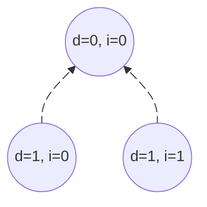
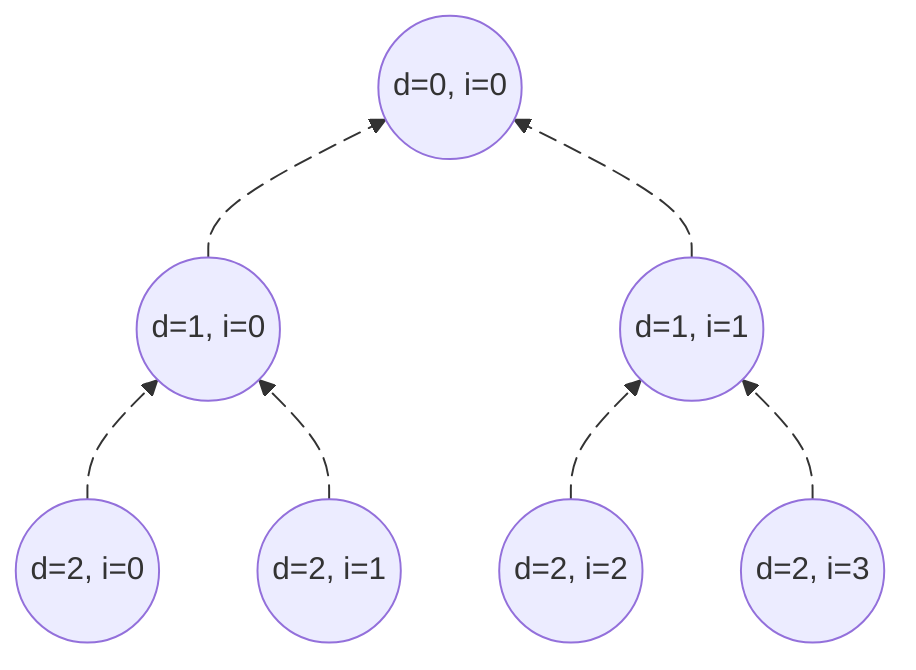

## Example encding for N = 2

**1. Polar transform $\mathbf{G}_2$**

$$
\mathbf{G}_2 \;=\; 
\begin{bmatrix}
1 & 0 \\[6pt]
1 & 1
\end{bmatrix}
$$

**2. $\vec{u}$ is a input vector for polar encoding (channel encoding). It is a result of source encoding**

$$
\vec{u} = \begin{pmatrix} u_{1} & u_{2} \end{pmatrix}
$$

**3. $\vec{x}$ is a vector that represents code word (it is $\vec{u}$ after encoding)**

$$
\vec{x} = 
\vec{u} \times
\mathbf{G}_2
$$

$$
\vec{x} = 
\begin{pmatrix} 
u_{1} & u_{2} 
\end{pmatrix} \times
\begin{bmatrix}
1 & 0 \\[6pt]
1 & 1
\end{bmatrix} =
\begin{pmatrix} 
u_{1} + u_{2} & u_{2} 
\end{pmatrix}
$$

**4. Encoding tree**

!!! info "Nodes info"
    
    d - means depth, i - ID of node on given depth

    - (d=0, i=0) $\quad\vec{u^{(2)}} = \begin{pmatrix} u_{1} + u_{2} & u_{2} \end{pmatrix}$
    - (d=1, i=0) $\quad u_1$
    - (d=1, i=1) $\quad u_2$

    

## Example encoding for N = 4

**1. Polar transform $\mathbf{G}_4$**

!!! warning
    $\otimes\;$ is a Kronecker product of two matrices.

$$
\mathbf{G}_4 = 
\mathbf{G}_2 \otimes 
\mathbf{G}_2
$$

$$
\mathbf{G}_4 \;=\;
\begin{bmatrix}
1 & 0\\[6pt]
1 & 1
\end{bmatrix}
\otimes
\begin{bmatrix}
1 & 0\\[6pt]
1 & 1
\end{bmatrix}
$$

$$
\mathbf{G}_4 \;=\; 
\begin{bmatrix}
1 & 0 & 0 & 0\\[6pt]
1 & 1 & 0 & 0\\[6pt]
1 & 0 & 1 & 0\\[6pt]
1 & 1 & 1 & 1
\end{bmatrix}
$$

**2. $\vec{u}$ is a input vector for polar encoding (channel encoding). It is a result of source encoding**

$$
\vec{u} = \begin{pmatrix} u_{1} & u_{2} & u_3 & u_4 \end{pmatrix}
$$

**3. $\vec{x}$ is a vector that represents code word (it is $\vec{u}$ after encoding)**

$$
\vec{x} = 
\vec{u} \times
\mathbf{G}_4
$$

$$
\vec{x} = 
\begin{pmatrix} 
u_{1} & u_{2} & u_{3} & u_{4}
\end{pmatrix} \times
\begin{bmatrix}
1 & 0 & 0 & 0\\[6pt]
1 & 1 & 0 & 0\\[6pt]
1 & 0 & 1 & 0\\[6pt]
1 & 1 & 1 & 1
\end{bmatrix} =
\begin{pmatrix} 
u_1 + u_2 + u_3 + u_4 & u_2 + u_4 & u_3 + u_4 & u_4
\end{pmatrix}
$$

**4. Encoding tree**

!!! info "Nodes info"
    
    d - depth level, i - ID of node on given depth

    - (d=0, i=0) $\quad\vec{u^{(4)}} = \begin{pmatrix} \vec{u_{1}^{(2)}} + \vec{u_{2}^{(2)}} & \vec{u_{2}^{(2)}} \end{pmatrix} = \begin{pmatrix} u_1 + u_2 + u_3 + u_4 & u_2 + u_4 & u_3 + u_4 & u_4 \end{pmatrix}$
    - (d=1, i=0) $\quad \vec{u_1^{(2)}} = \begin{pmatrix} u_1 + u_2 & u_2 \end{pmatrix}$ 
    - (d=1, i=1) $\quad \vec{u_2^{(2)}} = \begin{pmatrix} u_3 + u_4 & u_4 \end{pmatrix}$
    - (d=2, i=0) $\quad u_1$
    - (d=2, i=1) $\quad u_2$
    - (d=2, i=2) $\quad u_3$
    - (d=2, i=3) $\quad u_4$

## General case

**1. Polar transform $\mathbf{G}_N$**

!!! warning
    $\otimes\;$ is a Kronecker product of two matrices.

$$
\mathbf{G}_N \;=\;
\begin{bmatrix}
1 & 0\\[6pt]
1 & 1
\end{bmatrix}
^{\otimes \ n} 
$$

!!! info "Symnols info"
    
    - $N$ - code word length ($N = 2^n$)
    - $K$ - number of information bits
    - $n$ - tree depth (5G uses $n <= 10$) 

**2. Reliability sequence**

Every reliability sequence include numbers of one-bit channels which are arranged in order from least to most reliable.

Examples of relaibility sequences:

$$
\begin{aligned}
N &= 32 \quad \begin{pmatrix} 
1 & 2 & 3 & 5 & 9 & 17 & 4 & 6 & 10 & 7 & 18 & 11 & 19 & 13 & 21 & 25 & 8 & 12 & 20 & 14 & 15 & 22 & 27 & 26 & 23 & 29 & 16 & 24 & 28 & 30 & 31 & 32
\end{pmatrix} \\
\\
N &= 16 \quad \begin{pmatrix} 
1 & 2 & 3 & 5 & 9 & 4 & 6 & 10 & 7 & 11 & 13 & 8 & 12 & 14 & 16
\end{pmatrix} \\
\\
N &= 8 \quad \begin{pmatrix} 
1 & 2 & 3 & 5 & 4 & 6 & 7 & 8 
\end{pmatrix}
\end{aligned}
$$

In 5G standard reliability sequence (table) is defined for $N = 1024$. If we are using values of $N$ smaller than $1024$ e.g. $N = 8$ for $K = 5$ we have to shorten size of our sequence defined in standard. We do this by deleting from original sequence ($N = 1024$) every numbers of channnels that are smaller than $N = 8$. So for $N = 8$ we are deleting every channels numbers that are not included in the range $\left[ 1, 8 \right]$

**3. Frozen bits**

We are choosing $N - K$ least reliable bit channels (its numbers will be indexes of frozen bits in code word) from reliability sequence that we have created in previous point. Bits with these indexes are set to $0$. On the rest of the bits we are writing information bits from original input sequence (message) of lenght $K$. Created in this way sequence of lenght $N$ is fed to the encoder input (as the leafs of the encoding tree).

**4. Example of creating vector $\vec{u}$ according to 5g standard for code (8, 4)**

!!! info "Code parameters"
    
    $N = 8 \qquad K = 4 \qquad N - K = 4$

!!! info "Symbols info"
    
    - $f$ - frozen bit
    - $m_i$ - message bit

$$
\begin{aligned}
\text{reliability sequence} &= 
\begin{pmatrix} 1 & 2 & 3 & 5 & 4 & 6 & 7 & 8 \end{pmatrix} \\
\\
\text{frozen bits} &= 
\begin{pmatrix} 1 & 2 & 3 & 5 \end{pmatrix} \\
\\
\text{message bits} &= 
\begin{pmatrix} 4 & 6 & 7 & 8 \end{pmatrix} \\
\\
\vec{u} &=
\begin{pmatrix} f & f & f & m_1 & f & m_2 & m_3 & m_4 \end{pmatrix} = 
\begin{pmatrix} 0 & 0 & 0 & m_1 & 0 & m_2 & m_3 & m_4 \end{pmatrix}
\end{aligned}
$$