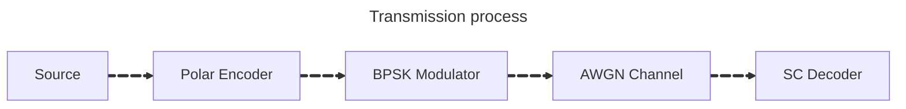

# Operation overview

## Transmission process
Project simulates transsmission process (with focus on 5G polar code) in following steps:

1. Message source
2. Polar encoding
3. BPSK modulation
4. Sending through AWGN channel
5. Successive Cancelation decoding

